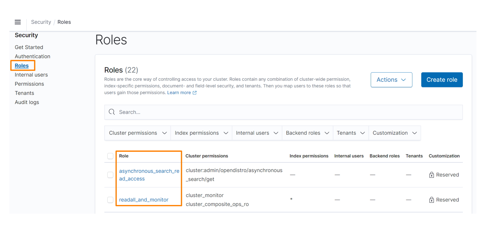
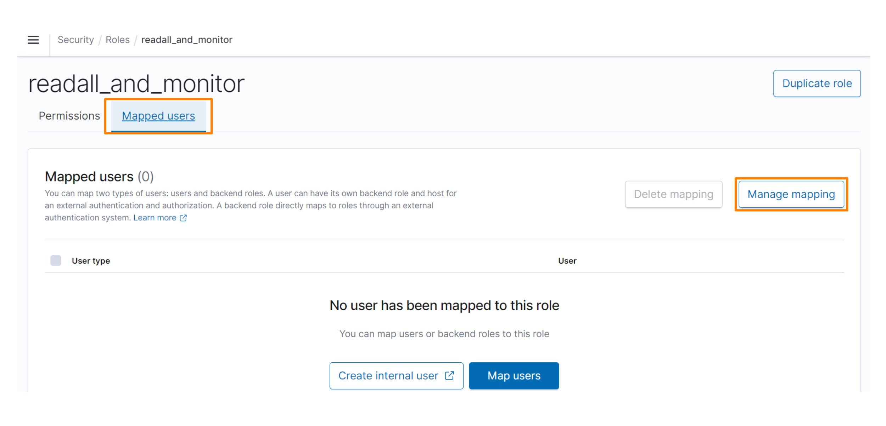
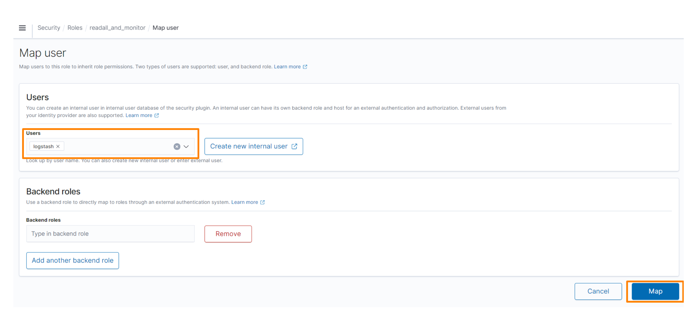
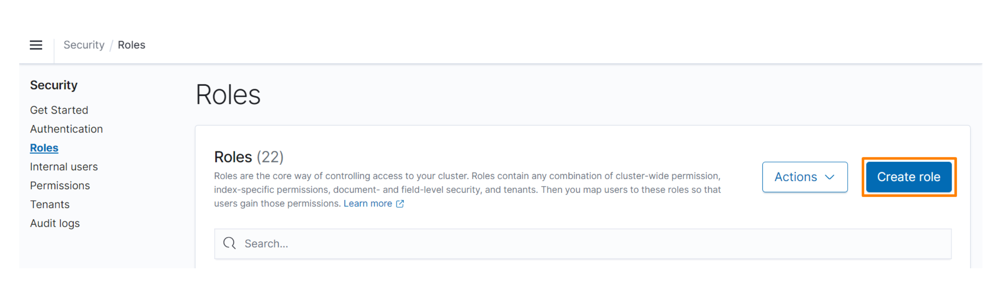
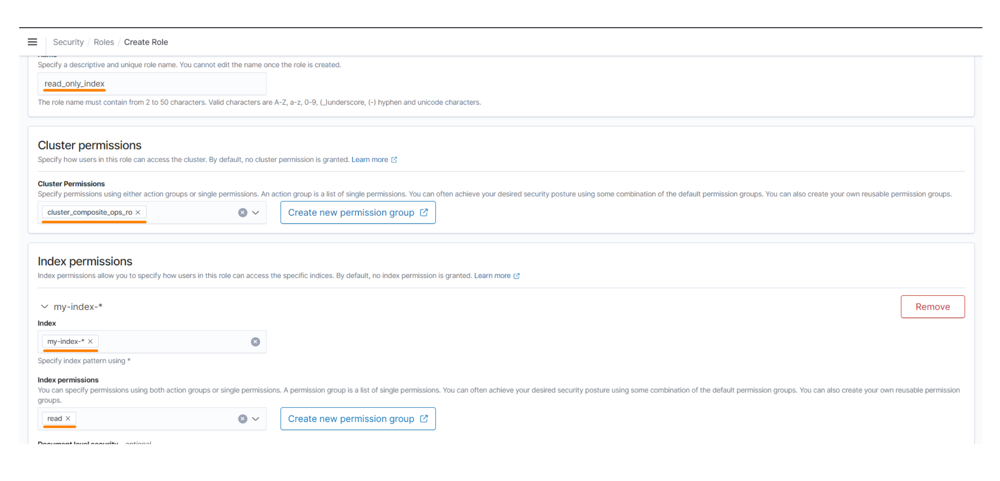
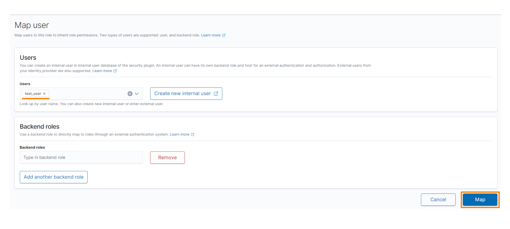
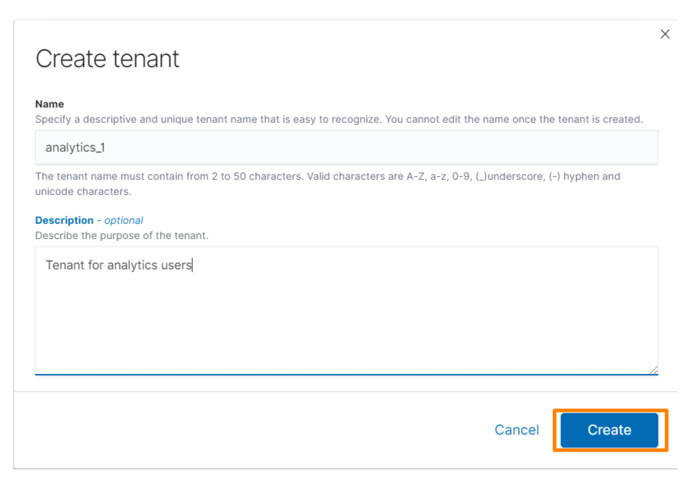
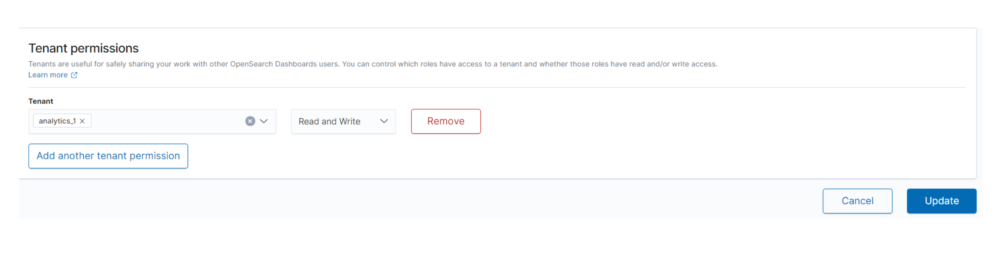

Руководство Администратора
==========================

Пользователи и роли
	Роли - это основной способ управления доступом к вашему кластеру. Роли содержат любую комбинацию разрешений на уровне кластера, разрешений для индекса, безопасности на уровне документов, полей и клиентов. Затем вы сопоставляете пользователей с этими ролями, чтобы пользователи получали эти разрешения.

Создание роли
Выберите *Security*, *Roles и role*.

Выберите вкладку *Mapped users* и *Manage mapping*.

Укажите пользователей или внешние удостоверения (также известные как серверные роли).
Нажмите *Map*.

Предопределенные роли
---------------------

Плагин безопасности включает несколько предопределенных ролей, которые могут быть полезны по умолчанию.

.. csv-table:: Роли и значения
   :header: "Роли", "Описание"
   :widths: 30, 50

   "alerting_ack_alerts", "Предоставляет разрешения на просмотр и подтверждение алертов, но не на изменение пунктов назначения (destinations) или мониторов."
   "alerting_full_access", "Предоставляет полные разрешения на все действия по алертингу."
   "alerting_read_access", "Предоставляет разрешения на просмотр предупреждений, пунктов назначения (destinations) и мониторов, но не на подтверждение алертов, пунктов назначения (destinations) или мониторов."
   "anomaly_full_access", "Предоставляет полные разрешения на все действия по обнаружению аномалий."
   "anomaly_read_access", "Предоставляет разрешения на просмотр детекторов, но не на создание, изменение или удаление детекторов."
   "all_access", "Предоставляет полный доступ к кластеру: все операции в масштабе кластера, запись во все индексы, запись во всех тенантах."
   "kibana_read_only", "Специальная роль, которая не позволяет пользователям вносить изменения в визуализации, дашборды и другие объекты OpenSearch Dashboards."
   "kibana_user", "Предоставляет разрешения на использование OpenSearch Dashboards: поиск в масштабе кластера, мониторинг индексов и запись в различные индексы OpenSearch Dashboards."
   "logstash", "Предоставляет разрешения для взаимодействия Logstash с кластером: поиск в масштабе кластера, мониторинг кластера и запись в различные индексы Logstash."
   "manage_snapshots", "Предоставляет разрешения на управление репозиториями снапшотов, создание снапшотов и восстановление снапшотов."
   "readall","Предоставляет разрешения для поиска в масштабе кластера, как и msearch, а также разрешения на поиск для всех индексов."
   "readall_and_monitor", "То же readall, но с добавленными разрешениями на мониторинг кластера."
   "reports_read_access", "Предоставляет разрешения на создание отчетов (report) по запросу, загрузку существующих отчетов и просмотр отчетов по расписанию (report definition), но не на создание отчетов по расписанию (report definition)."
   "reports_instances_read_access", "Предоставляет разрешения на создание отчетов по запросу и загрузку существующих отчетов, но не на просмотр или создание отчетов по расписанию (report definition)."
   "reports_full_access", "Предоставляет полные разрешения для отчетов."
   "asynchronous_search_full_access", "Предоставляет полные разрешения для всех действий асинхронного поиска."
   "asynchronous_search_read_access", "Предоставляет разрешения на просмотр асинхронных поисков, но не на подтверждение, изменение или удаление асинхронных поисков."

Примеры ролей
-----------------
В следующих примерах показано, как можно настроить роль только для чтения и роль для операции "bulk".

**Настройка пользователя с правами только для чтения в OpenSearch Dashboards**

Создайте новую read_only_index роль:

1. Откройте OpenSearch Dashboards.
2. Выберите *Security*, *Roles*.

3. Создайте новую роль с именем read_only_index.
4. В разделе *Cluster permissions* добавьте разрешение cluster_composite_ops_ro.
5. В разделе *Index Permissions* добавьте шаблон индекса. Например, вы можете указать 'my-index-*'.
6. Добавьте разрешение *read* в окне *Index permissions*.

7. Нажмите Create в нижней части страницы.

Назначьте пользователю три роли:
Выберите вкладку *Mapped users* и *Manage mapping*.
В окне *Users* добавьте своего пользователя, который будет обладать правами только для чтения.
Нажмите *Map*.

Повторите эти действия для kibana_user и kibana_read_only ролей.

Настройка роли для операции bulk в ADLS Dashboards
--------------------------------------------------------

Создайте новую bulk_access роль:

1. Откройте OpenSearch Dashboards.
2. Выберите *Security*, *Roles*.
3. Создайте новую роль с именем "bulk_access".
4. В разделе *Cluster permissions* добавьте разрешение cluster_composite_ops.
5. В разделе *Index Permissions* добавьте шаблон индекса. Например, вы можете указать my-index-*.
6. Добавьте разрешение "write" в окне *Index permissions*.
7. Нажмите "Create".

**Сопоставьте роль с вашим пользователем:**

1. Выберите вкладку *Mapped users* и *Manage mapping*.
2. В окне *Users* добавьте своего пользователя, который будет обладать правами для операции "bulk".
3. Нажмите *Map*.

**Мультитенантность ADLS DASHBOARDS**

Тенанты в ADLS DASHBOARDS - это пространства для хранения индекс-паттернов, визуализаций, дашбордов и других объектов ADLS DASHBOARDS. По умолчанию все пользователи ADLS DASHBOARDS имеют доступ к двум пространствам: частному и глобальному . Глобальный тенант используется всеми пользователями ADLS DASHBOARDS. Частный клиент является эксклюзивным для каждого пользователя и не может использоваться совместно.
Вы можете использовать частный клиент для исследовательской работы, создавать подробные визуализации с вашей командой в *analysts* тенанте и поддерживать сводную панель мониторинга для корпоративного руководства в *executive* тенанте.

**Добавление тенантов**

1. Откройте ADLS DASHBOARDS.
2. Перейдите во вкладку *Security*, нажмите *Tenants* и *Create tenant*.

.. image:: imgs/admin_7.png

3. Введите имя тенанта и описание.
4. Выберите Create.

**Предоставление ролям доступ к тенантам**

После создания тенанта, нужно предоставить ему доступ к роли с помощью ADLS DASHBOARDS

1. Откройте ADLS DASHBOARDS.
2. Выберите Security, Roles и нужную роль.
3. В разделе Tenant permissions добавьте тенантов и дайте роли разрешения на чтение и/или запись.

   