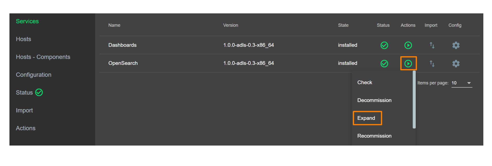
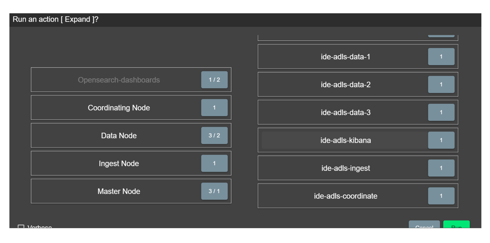

Инструкция по установке кластера ADLS
=====================================

1. Загрузка бандла **Arenadata LogSearch**
------------------------------------------
Для начала работы с компонентами **ADLS**, необходимо загрузить бандл в текущий инстанс **ADCM**, с помощью действия “Upload Bundles”

2. Создание кластера
--------------------
Следующим шагом является создание кластера **ADLS** с помощью действия “Create cluster” в разделе “Clusters”

После чего, выберите имя кластера и завершите конфигурацию с помощью кнопки “Create”.

Выберите необходимые компоненты в интерфейсе **ADCM**

Далее перейдите в раздел “Host-Components” и распределите компоненты по хостам

.. important:: Все необходимые хосты должны быть созданы перед установкой компонентов

3.Конфигурирование сервисов
^^^^^^^^^^^^^^^^^^^^^^^^^^^

Конфигурирование сервисов
Следующим шагом в процессе установки **ADLS** является задание настроек на странице сервиса OpenSearch “Configuration”:

Cluster Settings
	В данном разделе необходимо указать желаемый размер JVM Heap Size машин.

.. important:: Важно: размер JVM не должен превышать 50% от оперативной памяти машин, а также не быть более 30ГБ

4.Завершение установки
----------------------
	
.. important:: Перед запуском установки убедитесь что в интерфейсе более нет предупреждений в части конфигурации сервисов.
 
Для завершение процесса установки ADLS перейдите в раздел Cluster и выберите действие “Install” в разделе “Action”
После завершения установки, все компоненты должны иметь “зеленый” статус

.. important::В веб-интерфейс Dashboards можно зайти по адресу <ip_адресс_хоста_Dashboards>:5601

5.Масштабирование кластера ADLS
-------------------------------

Для добавления новых машин в кластер ADLS перейдите в раздел Services и выберите действие “Expand” в разделе “Action” сервиса OpenSearch

Далее распределите новые компоненты по хостам и нажмите “Run”

6.Удаление Data ноды из кластера
--------------------------------

Для удаления Data ноды сначала необходимо произвести её декоммиссию, т.е. переместить данные на другие свободные ноды. Для этого перейдите в раздел Services и выберите действие “Decommission” в разделе “Action” сервиса OpenSearch. Далее нажмите "+" и введите хосты, которые нужно декоммиссить и нажмите "Run".

.. important:: До того, как Data нода будет удалена, вы можете вернуть обратно данные на неё. Для этого проделайте шаги, описанные выше, но выполните действие "Recommission".

Теперь можно безболезненно удалить Data ноду из кластера. Для этого перейдите в раздел "Services" и выберите действие “Remove” в разделе “Action” сервиса **ADLS**. Вам будет предложено выбрать конфигурацию "Force remove" (не рекомендуется), если вы хотите удалить Data ноду на которой есть данные. Если же декомиссия прошла успешно, то нажмите "Next". 

Далее необходимо убрать нужные хосты из компонентов и нажать "Run".   

7.Удаление других типов нод из кластера
---------------------------------------

Для этого перейдите в раздел "Services" и выберите действие “Remove” в разделе “Action” сервиса **ADLS**. Далее нажмите "Next", уберите нужные хосты из компонентов и нажмите "Run".

